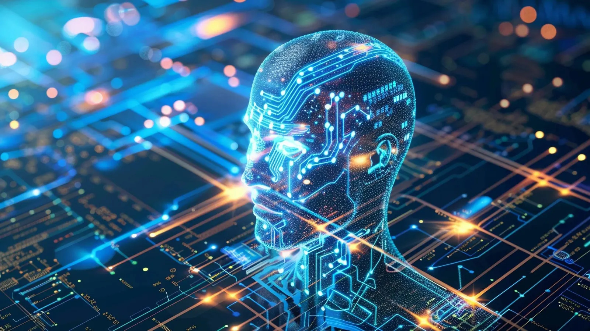

## I. Introduction

It's undeniable that AI has become fundamentally ingrained into our society's everyday life, with education certainly being one of the more "affected" areas. Some say AI is a cheat, whether you use it to cheat on an assignment or you use it to create a drawing. Others say AI can be a great tool for our species going forward into the future, making us more efficient at learning skills and finishing tasks. For software engineering specifically, AI is an interesting subject as programmers are the ones responsible for creating all these various AIs. Within ICS 314, using AI was not banned and in fact was encouraged at times to be used as a tool. I personally ended up using ChatGPT, Co-Pilot, and GitHub Co-Pilot various different times throughout the course and have some opinions about AI's place in both education and software engineering.

## II. Personal Experience with AI

## 1. Experience WODs

Generally since these WODs had an instructional video to follow if I had any trouble, I barely used any AI for them. I would attempt each after reading the directions once and usually I would figure it out and complete the WOD in time. In the case I ran into a problem, I would continue trying to problem solve until time ran out, then I would watch the video before attempting the WOD a second time. The only times I may have used AI was if there was some error in my code that I just absolutely could not fix and was obviously not related to the topic being taught through the WOD.

## 2. In-class Practice WODs

For these WODs whenever I'd run into a problem, I would end up just trying to figure it out until time was over and that was that. I may have used AI a few times in order to identify some small issue for example relating to something like syntax but for the most part I did not use AI and I simply kept trying to figure the problem myself until time was out. Since these were practice, I did not feel any particular pressure to complete them so I was okay with "failing" some of these WODs.

## 3. In-class WODs

During the actual in-class WODs, if I encountered a problem or an error in my code I would try to solve it on my own for a bit. But in the case it took up a big chunk of my time or I was running out of time fast, I did rely on AI to help save me. It didn't particularly matter what kind of problem I was encountering, if it was clear I would need to use AI to even have a chance at passing the WOD, I did indeed use it. When we began doing the harder WODs, AI started to become a bit less reliable or effective at times but even then, to me it was almost like getting a second opinion from someone else. So I definitely still found it helpful in those scenarios.

## 4. Essays

I really never used AI for any of the essays at all since for essays, there's really no right or wrong. Yes, AI can help give ideas or help your words sound clearer or more professional but to me, there wasn't a big need to use AI.

## 5. Final Project

Throughout the entirety of my group's final project, I did use AI quite extensively. At this point, because we were working on such a large and complex piece of software, the kinds of issues we'd run into especially with all of the different moving parts needing to work together were very complicated and hard to debug. A lot of database and prisma or schema issues I consulted AI on as there seemed to be nothing that worked at times and even after using AI, many times the answer still was not clear. Passing different data types, missing data, user authentication, server side vs client side, and unidentifiable errors were all some of the big challenges I faced while working on this final project. I needed to use multiple different AIs for some of these issues as they sometimes gave different advice, advice which was honestly quite needed.

## 6. Learning a Concept

When learning a particular concept, I didn't use AI and I believe using AI is detrimental to learning a concept. In my opinion, you read or watch a guide in order to learn a concept. Then you take what you've learned and try putting it into practice and even if you run into some errors or difficulty at first, you keep at it mostly on your own, or as much as possible. Only if you have truly exhausted your mind and your teaching guides, should you use AI when learning a new concept.

## 7. Answering a question in class or in Discord

I never really answered many questions in class or on Discord and if I did it was usually something very basic that I wouldn't need help from AI from. But I suppose fact checking yourself is a way AI could be useful in this scenario.

## 8. Asking or answering a smart-question

Again, I never really did this but I can see how using AI to fact check yourself could be helpful. I don't see how or why you'd use AI to help ask a question. I'm personally of the belief that while we as people should try not to ask "dumb" questions, it's not a big deal and there's no reason to ask AI to help you ask a question.

## 9. Coding Example

Going back to my thoughts on using AI when learning a concept, if I can't seem to figure out the problem with my code or how to use and implement something on my own no matter what, I think it would be okay to ask AI for help. Asking for a coding example in this situation would be reasonable in my opinion. I did ask for coding examples from AI when I was working on the final project whenever I ran into one of the problems I mentioned above. I would try anything and everything and sometimes that included ask AI for a coding example.

## 10. Explaining Code

I did not use any AI to explain any code as I feel any code I did need to understand I either just did or there were other ways to figure out what it meant than asking AI. I think it's probably best practice to try and decipher code on your own before consulting AI.

## 11. Writing Code

This is something I do believe is not good to use AI for as this goes beyond the idea of using AI as a "tool" and leans on the "cheat" side much more. I never used AI to write code for me, the closest would be if I asked for some example code and I used it to help myself write similar code.

## 12. Documenting Code

I wrote all of my documentation by myself as I never felt like I needed to ask AI to help me explain code that I wrote. I think this should probably be the case for everyone else and if it isn't, it might be a bad sign.

## 13. Quality Assurance

So when I was working on the final project and I ran into the kinds of errors that didn't actually spit out an error message or I already tried implementing what the AI previously said, I would resort to copy and pasting all of the possibly relevant code into the AI, asking what was wrong with it. I found that especially for the times no error message appeared, this was really the only way for me to go about fixing my code. Doing this didn't always work but it was just an option that I felt I needed to exhaust at some point.

## III. Impact on Learning and Understanding

I think for me, AI has been very useful as a tool to get myself out of some pinches. In that way it supplements my learning as it gets rid of any insurmountable obstacles in my path but doesn't replace my learning or prevent natural, digestible obstacles from forming in my path. If used properly, it can make learning smoother and more fun/less frustrating. Which for me it did.

## IV. Practical Applications

In my opinion there are a lot of very practical application of AI in the real world. You see it today with AI helping diagnose illnesses and allowing real time translations to become a reality. The key to this is that AI is again used as a tool to supplement humans or using AI to accomplish tasks that are impossible using only humans. Generative AI while does have some use in my opinion, shouldn't be used to entirely replace the human component of creating something. Something that I am conflicted on is something like using AI for self driving as I see the argument that self driving cars could be much safer than human driven cars but the problem is that is if and only if everything is in sync and it works as intended. But at that point maybe it just sounds like you're making an argument for humans.

## V. Challenges and Opportunities

The only challenges I encountered with AI in ICS 314 were just when either AI couldn't figure out a problem and when it got stuck on a particular topic and didn't address what I wanted it to. But those were small inconveniences and I really only saw using AI and asking it for help as the same type of thing as going on Stack Overflow or Reddit and asking for help. I think AI could definitely be used more in helping find and fix small things like syntax errors but besides that I don't see a need for AI to used in a particular way for software engineering.

## VI. Comparative Analysis

I compared using AI and asking it for help earlier to asking for help on Stack Overflow or Reddit and that's my main take on this. AI is just kind of a guide that you can ask for help if you really need it like any real person, except it's always available and answers very detailed, very quickly. Just like with a real person, you can have a back and forth asking further about something in particular and asking for the AI to elaborate on it. Developing skills and retaining knowledge are key parts of learning and abusing AI could definitely hurt those aspects of the learning process for some so I think it's important to emphasize learning without AI as much as possible.

## VII. Future Considerations

Obviously for software engineering, there could be more AI made with specific topics and niches in mind so that each one can be better and more accurate when answering someone's questions. Right now a lot of AI used in software engineering wasn't made with it in mind so that could be a possible area for improvement.

## Conclusion

Using AI can be a double edged sword. It can be very useful or very detrimental depending on how it's used. There's no denying that people will continue to use AI in software engineering and any courses on it. I think we as people have to accept its existence and people's use of it so AI must be embraced in some capacity. Perhaps having a course specifically for teaching you how to effectively use AI could be the next step. AI has a big future, we as people need to keep up with it.
