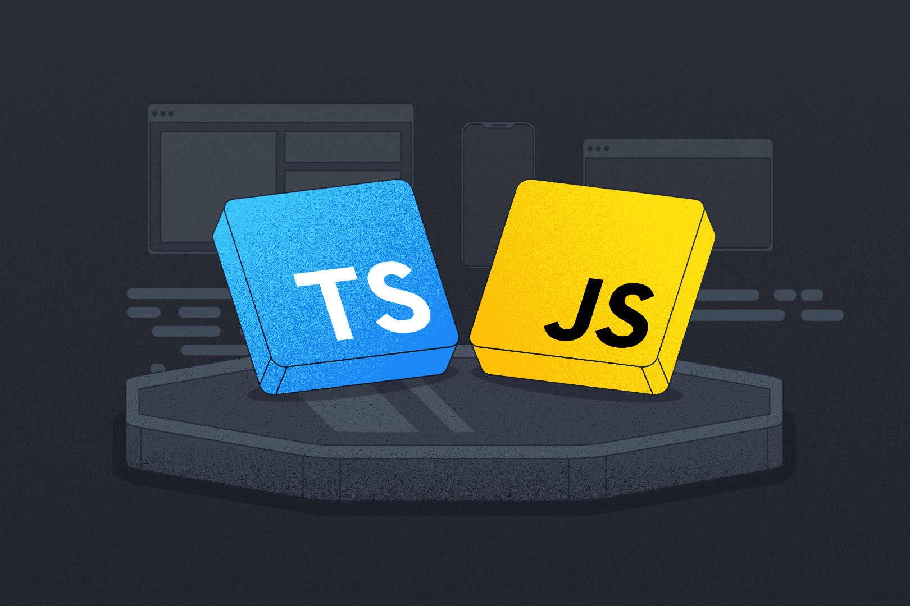

## Opening

Let me start by prefacing my situation. I have not done consistent, intensive programming in my life for quite a while now. For the last two semesters I took at UH Manoa, I didn't actually take an ICS course nor did I barely even code in my free time. So after about a year, here I am returning to programming and computer science. In particular, I am currently taking ICS 314. Now in this course, I am being introduced to TypeScript for the first time in my life. Here's my very early, short take on it. 

It's actually quite good and refreshing.

## Background Talk

Okay now for some background on why. The programming languages I've had expereince with up until now are Python, C, Java, and JavaScript. Python is so interesting because when you get familiar with it as a novice in computer science, you love it.  You compare it to other languages, and you applaud it for being so simple, so easy, so intuitive. It feels like you're not burdened by the vast unknown and you feel safe with it. But as you code more with Python and learn to use other languages at a higher level, you actually feel like it limits you. The various runtime errors, the slow execution, and the lack of database management systems. The more you use other languages, the more robust everything else feels in comparison. Now to be fair, C in my opinion also doesn't feel very robust. With the amount of odd errors and annoyingly specific rules you have to follow, it's clear that C is just old. I don't want drive a manual car in the year 2025. Java is good, but not great. The main problem with Java is that other languages are just simpler than it. It's not terrible but I think it's just a bit tedious to have to write all of this.

```java
public class Main {
    public static void main(String[] args) {
        System.out.println("Hello World");
    }
}
```

When in JavaScript you only have to do this.

```javascript
console.log("Hello World");
```

I think this makes it quite clear which one was my favorite.

## Getting to TypeScript

Comparing TypeScript to JavaScript, the immediate first thing that jumped out to me was that with TypeScript was that it catches errors before you run the code. I thought that was just such a nice quality of life improvement. TypeScript also has generics, which is a nice addition in my opinion. The type rigidity is something I appreciate in one way due to it making functions more clear but I suspect that it may prove to be limiting in the future. Learning TypeScript with  prior JavaScript knowledge is odd because it feels familiar but new and kind of tedious at first. But I think going forward and using it more, I will likely enjoy it and prefer it over anything else.

## So Why Is It Refreshing?

TypeScript gives something that isn't so new and unknown but is fresh enough that it's intriguing. It also comes with some key benefits; More of which I'm sure I'll find over time. With that being said, it is certain that I'll find things that I don't like but for now that's okay. TypeScript might be exactly what I needed. The reason why I didn't take any ICS classes and didn't code for about a year was that I kind of became sick of it. I haven't really been the biggest fan of the ICS college classes and the way you are intended to learn. I lost my passion for learning and creating. Being forced to code in C and write code out on paper really kills my spirit. Now I know that I'll probably have to do more of those things or other unfun things in the future. But right now I need to find my passion and find my fun again. That's why TypeScript is refreshing and why I hope using it in athletic software engineering will give me a second chance.
