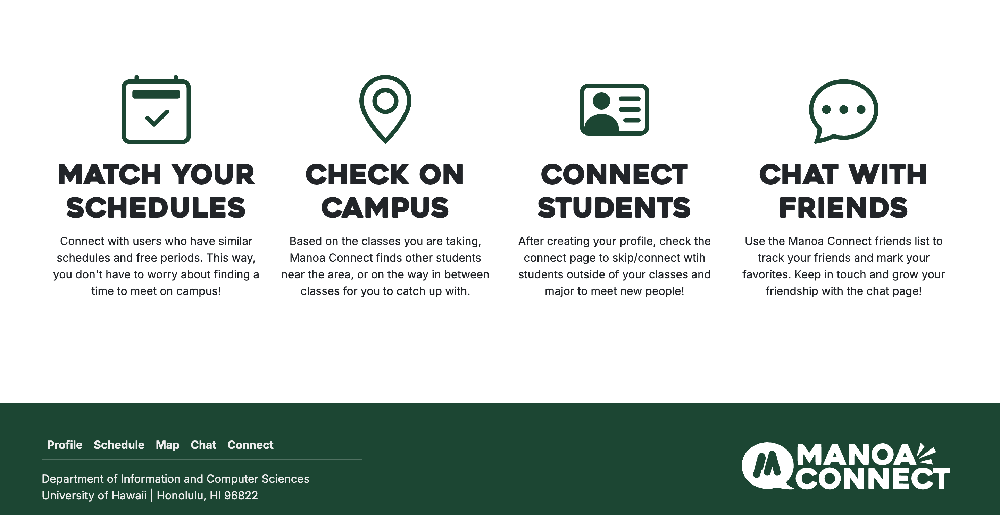
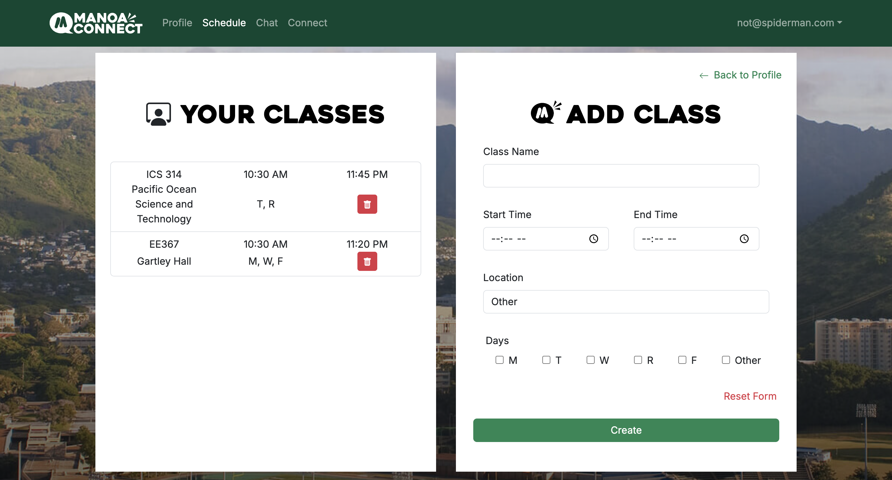
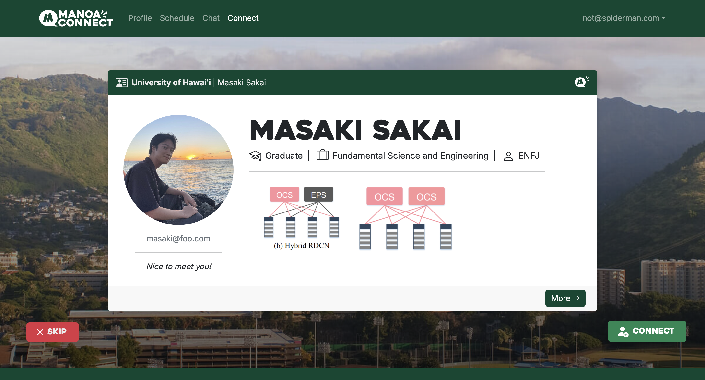
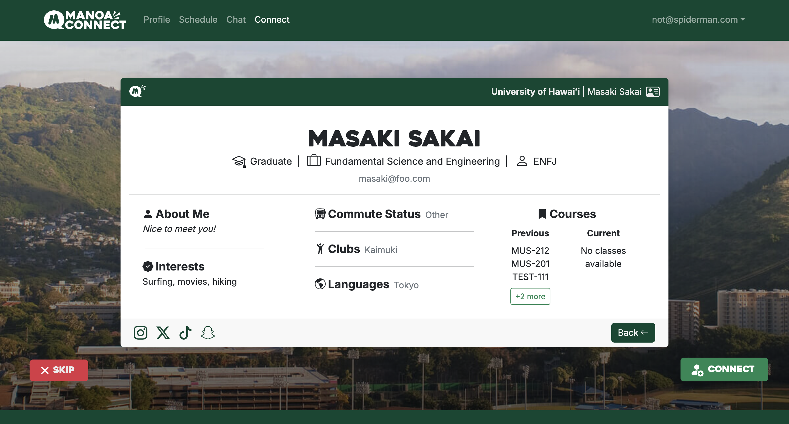
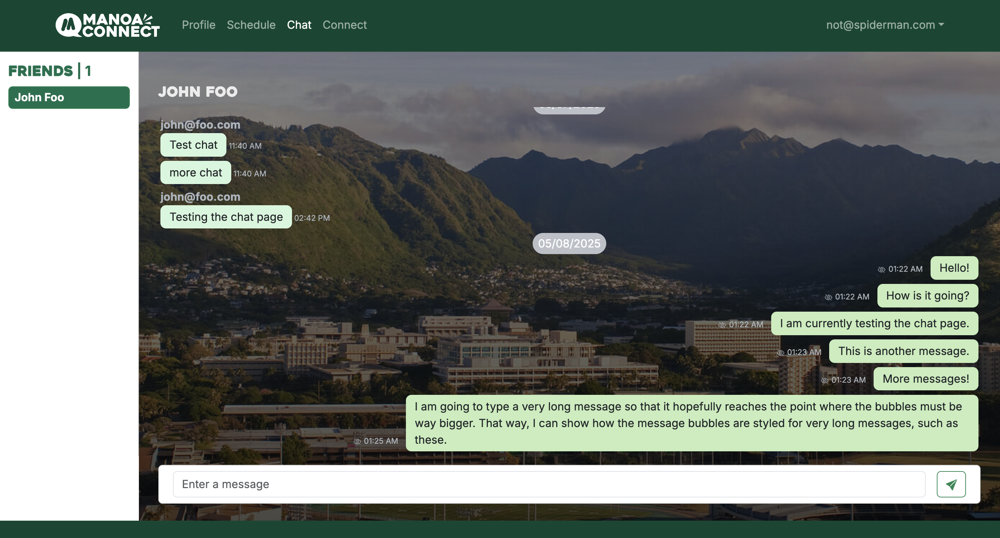
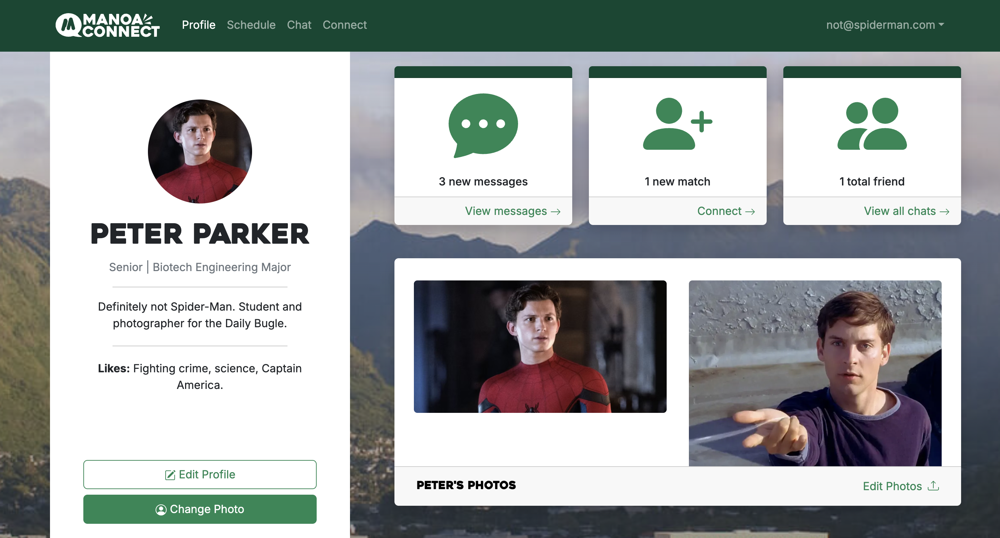
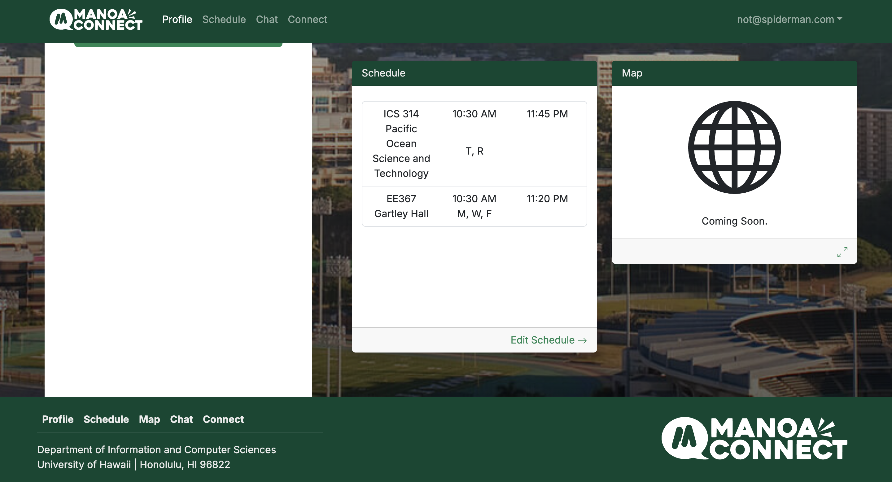
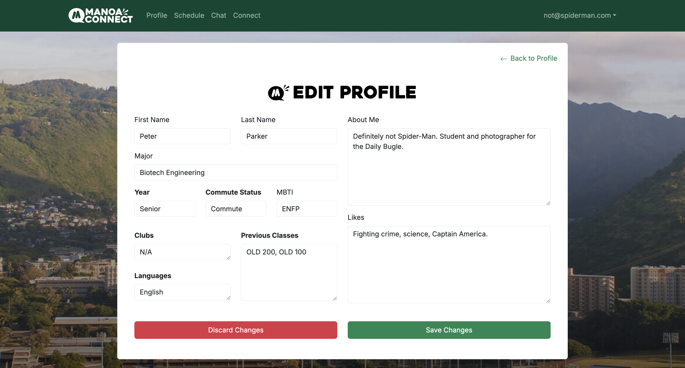

  
  

## Overview

We found the problem that many of the people you meet as college students are usually within the same majors and fields as you meet most of them in your classes or clubs related to your major. So this is where our website Manoa Connect comes in to allow UH Manoa students to meet people outside of their major and chat with them, making friends along the way. To accomplish this, we used Postgres SQL for our database and a mix of TypeScript, ReactJS, React Bootstrap, and NextJS to make each page. Our site has 4 main features:

- Creating/editing your profile

  

- Editing your schedule

  

- Matching with others

  
  

- Chatting with friends

  

## Responsibilities

I was in charge of making the user home page, the profile creation/editing page, and the schedule editing page. I was also an assistant project manager that helped oversee the entire project and make sure each member was on task through our implementation of agile project management.

Here is the user profile page:

  
  

And here is the edit profile page:

  

## Developers

- Aaron Ramos
- Masaki Sakai
- Chaezen-Lee Pebria
- Codie Nakamura

You can learn more at the [Our Project Landing Page](https://manoa-connect.github.io/) and [Our GitHub Page](https://github.com/manoa-connect/manoa-connect).
