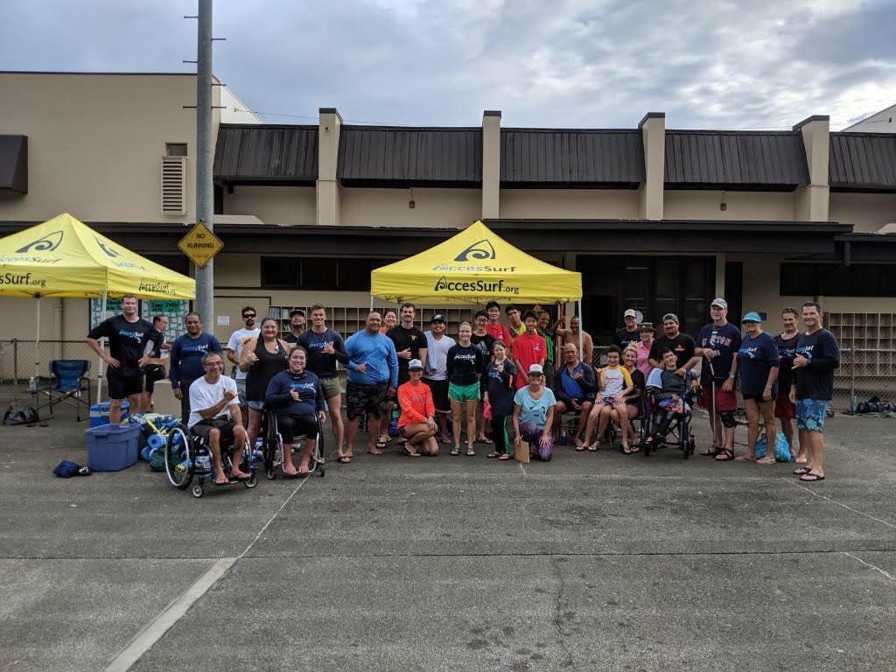

  

The REACH Challenge is a competition where students design adaptive or assitive technological solutions for people in need within their community. It is a nationwide competition for middle and high school students. Students are expected to go out into their community and connect with people who face unique challenges in their day to day lives. They will then with the help of their advisors and the Educators Toolkit, engineer a solution for someone in need.

My team was a group of 3, who over the course of 5 months iterated on a design on a wheelchair that could smoothly go across the sand on a beach. We came to the conclusion that the traditional wheels on a wheelchair were just too thin and dug into the sand. So we replaced the original two wheels with wheels from a bicycle that were a bit wider and gave more traction. This still wasn't good enough so we decided to add a third wheel. The wheel was the type of wheel you'd find on a wheelbarrow. The majority of time was spent on figuring out how to attach both the bicycle wheels and the third wheel. Taking our final design to the beach, it rolled across without a hitch.

Talking with Paralypian Ann Yoshida was very insightful as I never had anyone close to me be wheelchair bound. From the challenging recovery process to the everyday difficulties, you couldn't help but feel inspired. Throughout the process of iterating on the wheelchair, I learned a lot about working efficiently as a team. This was the first time I had ever participated in an extracurricular project so I was a little out of my element. I realized that you have to have the guts to go ahead with an idea. You can't just keep brainstorming and only discuss your plan. You have to actually use your plan and take that leap.

You can learn more at the [REACH Challenge](https://www.iteea.org/reach).
